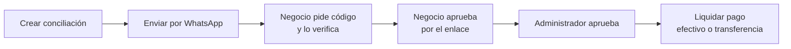
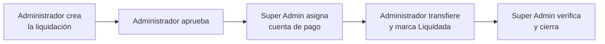

# Manual de usuario — Panel de Administración SaldoGrin

> Guía de uso del panel administrativo (`/dashboard`, `/accounts`, `/recharges`, etc.). Está escrita
> para quien opera el sistema día a día — administradores y soporte — no para desarrolladores.
> Si necesitas documentación técnica de la API, consulta `/api/docs` dentro del propio sistema.

## Índice

1. [Qué es SaldoGrin](#1-qué-es-saldogrin)
2. [Ingresar al sistema](#2-ingresar-al-sistema)
3. [Roles y qué puede ver cada uno](#3-roles-y-qué-puede-ver-cada-uno)
4. [Panel principal (Dashboard)](#4-panel-principal-dashboard)
5. [Cuentas (Clientes y Negocios)](#5-cuentas-clientes-y-negocios)
6. [Usuarios Autorizados](#6-usuarios-autorizados)
7. [Recargas](#7-recargas)
8. [Transferencias](#8-transferencias)
9. [Facturas](#9-facturas)
10. [Conciliaciones con Negocios](#10-conciliaciones-con-negocios)
11. [Conciliación de Comisión del Sistema](#11-conciliación-de-comisión-del-sistema)
12. [Historial de movimientos](#12-historial-de-movimientos)
13. [Monedas](#13-monedas)
14. [Tasas de cambio](#14-tasas-de-cambio)
15. [Pasarelas de pago](#15-pasarelas-de-pago)
16. [Administración (Usuarios, Roles, Clientes OAuth2)](#16-administración-usuarios-roles-clientes-oauth2)
17. [Preguntas frecuentes](#17-preguntas-frecuentes)

---

## 1. Qué es SaldoGrin

SaldoGrin administra el **saldo (billetera electrónica)** de dos tipos de cuenta:

- **Clientes**: personas que tienen saldo y lo gastan (pagando facturas, recibiendo/enviando
  transferencias).
- **Negocios**: cuentas que reciben el dinero de las facturas que les cobran a los clientes, y con
  las que periódicamente se hace una **conciliación** para liquidarles lo acumulado.

El flujo típico de dinero es:

1. Alguien le **recarga saldo** a una cuenta (efectivo, transferencia, tarjeta, o automáticamente
   desde un sistema externo).
2. El cliente puede **transferir** saldo a otra cuenta, o se le genera una **factura** por una
   compra en un negocio — al pagarla, se le descuenta el saldo a él y se le acredita al negocio.
3. El negocio va acumulando saldo por sus facturas cobradas. Periódicamente, un administrador
   **concilia** esas facturas con el negocio (el negocio las aprueba, luego un administrador, y
   finalmente se le liquida el pago en efectivo o transferencia).
4. Todo movimiento de saldo queda registrado en el **Historial**, con quién lo hizo y cuándo.

---

## 2. Ingresar al sistema

Entra a la dirección del panel (`/login`) con tu usuario y contraseña.

- Si olvidaste tu contraseña, usa el enlace "¿Olvidaste tu contraseña?" en la pantalla de login:
  recibirás un enlace de restablecimiento por WhatsApp al número registrado en tu usuario.
- Al cerrar sesión, usa el ícono de salida en la esquina inferior del menú lateral.

---

## 3. Roles y qué puede ver cada uno

Cada usuario del panel tiene un **rol**, y el rol determina qué secciones del menú ve y qué acciones
puede hacer. Los roles existentes hoy son:

| Rol | Para quién es | Alcance |
|---|---|---|
| **Super Administrador** | Dueño/responsable técnico del sistema | Ve y hace todo, incluida la sección de Administración (usuarios, roles, clientes OAuth2) y Pasarelas de Pago |
| **Administrador** | Operación diaria del negocio | Ve casi todo lo operativo (cuentas, recargas, transferencias, facturas, conciliaciones, historial), pero no administra usuarios/roles del panel ni pasarelas de pago |
| **Soporte** | Atención al cliente | Solo consulta (ver, detalles), sin crear ni modificar — para resolver dudas sin riesgo de alterar datos |

Si a un usuario le falta un permiso, simplemente no verá esa opción en el menú lateral ni podrá
acceder a esa pantalla. Para dar de alta un rol nuevo o cambiar permisos, ver
[Administración → Roles](#16-administración-usuarios-roles-clientes-oauth2).

---

## 4. Panel principal (Dashboard)

Es la primera pantalla al entrar. El selector de período arriba a la derecha (Hoy / Últimos 7 días /
Últimos 30 días) afecta a los bloques de **Operaciones** y **Saldo del sistema por moneda** — el
resto (cuentas, autorizados, actividad reciente, tasas de cambio) siempre muestra el estado actual,
sin importar el período elegido.

### Saldo del sistema por moneda
Una tarjeta por cada moneda activa, con:
- El **saldo disponible** (lo que las cuentas pueden gastar ya mismo) y, debajo, el **reservado**
  (cupos apartados para autorizados que aún no se han usado — no es saldo perdido, solo está
  comprometido).

Junto a esas tarjetas aparecen tres más:
- **Liquidado en moneda base**: lo que ya se les pagó a los negocios en la moneda base del sistema
  (la que se configura en el servidor, ej. EUR), dentro del **período elegido**.
- **Comisión disponible**: cuánta comisión retenida por el sistema (ver
  [Conciliaciones → Comisión del sistema](#10-conciliaciones-con-negocios)) queda todavía sin
  reclamar por el Super Administrador — a diferencia de las otras dos tarjetas, **no depende del
  período elegido**: es un saldo corriente que baja apenas se crea una liquidación de comisión
  (ver [Conciliación de Comisión del Sistema](#11-conciliación-de-comisión-del-sistema)), no recién
  cuando se cierra.
- **Liquidado en moneda secundaria**: igual que el primero, pero en la segunda moneda configurada
  (ej. CUP) — solo aplica a los negocios que tienen configurado un **split de pago** entre ambas
  monedas, también dentro del período elegido.

Si un negocio no usa split de pago, todo lo suyo cae en "Liquidado en moneda base"; si tiene split,
se reparte entre las dos tarjetas según el porcentaje que tenga configurado.

### Cuentas y Autorizados
- **Cuentas**: total y cuántas están activas (en verde), además de tarjetas separadas para
  **pendientes de aprobación** y **suspendidas** — sirven como alerta rápida de qué necesita
  atención.
- **Autorizados**: total y cuántos están activos.

### Operaciones
Para recargas, transferencias y facturas: cuántas hay de cada estado y el monto acumulado, dentro
del período elegido arriba. Útil para ver de un vistazo cuánto trabajo pendiente hay (por ejemplo,
facturas en estado "Pendiente" que todavía nadie cobró).

### Actividad reciente
Las últimas recargas, transferencias y facturas creadas, sin importar el período del selector —
es un vistazo al movimiento más reciente del sistema, no un reporte acotado en el tiempo.

### Tasas de cambio vigentes
La tasa activa más reciente para cada **moneda habilitada** del sistema (las monedas desactivadas en
[Monedas](#13-monedas) no aparecen aquí), junto al proveedor que la generó (o "Tasa manual" si se
cargó a mano) y hace cuánto se actualizó.

### Accesos rápidos
Botones directos a Cuentas, Recargas, Transferencias y Facturas, para no tener que ir al menú
lateral.

---

## 5. Cuentas (Clientes y Negocios)

Menú: **Cuentas**. Aquí se administran tanto los clientes como los negocios — se distinguen por el
campo **Tipo de Cuenta**.

### Listar y buscar
Usa el selector de tipo (Todos / Cliente / Negocio) y el buscador para filtrar. La tabla muestra
número de cuenta, nombre, documento, contacto, estado, moneda y saldo disponible.

### Crear una cuenta
Botón **Nueva Cuenta**:

- **Tipo de Cuenta**: Cliente o Negocio (esto no se puede cambiar después).
- Si es **Negocio**: se pide Nombre del Negocio. Si es **Cliente**: se pide Nombre y Apellido.
- **Tipo y Número de Documento**, **Correo**, **Teléfono** (con selector de país — importante:
  este es el número al que llegan los mensajes de WhatsApp, como enlaces de restablecimiento de
  contraseña, códigos de verificación de pago y notificaciones de conciliación).
- **Moneda** por defecto de la cuenta.
- Solo para **Negocio** — **Split de pago en conciliaciones** (opcional): qué porcentaje de cada
  liquidación se le paga en la moneda base del sistema y qué porcentaje en la moneda secundaria (los
  dos campos deben sumar 100%). Si se deja vacío, todo se liquida en la moneda base. Ver el detalle
  de cómo se aplica en [Conciliaciones → Split de pago entre monedas](#10-conciliaciones-con-negocios).

El número de cuenta lo asigna el sistema automáticamente. Al crear la cuenta, si tiene teléfono
configurado, se le envía automáticamente por WhatsApp un primer **código de verificación (PIN)** —
es el código que se usará luego para autorizar el pago de sus facturas (ver
[Facturas](#9-facturas)).

### Editar y cambiar estado
El lápiz edita los datos de la cuenta. El botón de encendido/apagado activa o suspende la cuenta —
una cuenta **suspendida** no puede operar (ni pagar facturas, ni recibir/enviar transferencias)
hasta que se reactive.

### Cuentas de pago (solo Negocios)
Para una cuenta de tipo **Negocio**, el ícono 🏦 (junto al lápiz, en la columna de acciones) abre el
listado de sus **cuentas de pago**: las cuentas bancarias reales a las que hay que transferirle el
dinero al liquidar una conciliación (ver [Conciliaciones](#10-conciliaciones-con-negocios)). Un
negocio puede tener varias, cada una en **una sola moneda** — si el negocio tiene split de pago
configurado (ver más abajo), va a necesitar al menos una cuenta por cada moneda del split.

Cada cuenta de pago guarda: alias (para identificarla), moneda, número de cuenta, banco (opcional),
SWIFT (opcional) y titular (opcional). Se puede editar, desactivar (sin borrar su historial) o
eliminar desde el mismo listado.

> Es el propio negocio quien elige, al aprobar cada conciliación por el enlace de WhatsApp, a cuál
> de sus cuentas registradas se le debe pagar (ver paso 4 de
> [Conciliaciones](#10-conciliaciones-con-negocios)) — el administrador solo las da de alta.

---

## 6. Usuarios Autorizados

Menú: **Autorizados**. Un "autorizado" es una persona a la que una cuenta (cliente o negocio) le da
permiso de gastar parte de su saldo, con límites propios — por ejemplo, un empleado al que se le
autoriza a hacer compras hasta cierto monto.

### Cómo usarlo
1. Selecciona primero la **cuenta** (arriba) — verás su saldo disponible en la moneda de la cuenta
   y en la moneda base del sistema.
2. La tabla muestra los autorizados de esa cuenta: nombre, correo, documento, límites y estado.
3. **Crear Usuario Autorizado**: nombre, correo, documento, teléfono y tres límites opcionales:
   - **Monto Máximo**: el tope por operación individual.
   - **Límite Diario** / **Límite Mensual**: topes acumulados por período.
   Dejar un límite vacío significa "sin tope" en ese aspecto.

### Acciones sobre un autorizado
- **Lápiz**: editar sus datos y límites.
- **Llave**: reiniciar su contraseña — le llega un enlace nuevo por WhatsApp.
- **Encendido/apagado**: activar o suspender al autorizado (uno suspendido no puede usar su acceso).

---

## 7. Recargas

Menú: **Recargas**. Una recarga es una entrada de dinero a una cuenta. Cada recarga recibe un
**código único autogenerado** (ej. `REC-00000001`), visible como primera columna de la tabla.

### Crear una recarga manual
Botón **Crear Recarga**: elige la cuenta, el monto y la moneda. Si la moneda no es la moneda base
del sistema, usa **Calcular conversión** para ver a cuánto equivale antes de guardar (el sistema
guarda ambos montos: el original y el convertido). Completa también el **Tipo** (Manual / External /
Transfer), el **Método de Pago** y, si aplica, el **Número de Referencia** y notas.

### Estados y acciones
Una recarga nace en estado **Pendiente**. Desde la tabla:
- ✅ **Completar**: acredita el saldo a la cuenta.
- ❌ **Marcar como fallida**: pide un motivo, y la recarga queda como no acreditada.
- 🚫 **Cancelar**: la anula sin acreditar saldo.

Los estados finales son **Completada**, **Fallida** y **Cancelada** — una vez ahí, no se puede volver
a operar sobre esa recarga. Haz clic en el ícono de ojo para ver el detalle completo.

---

## 8. Transferencias

Menú: **Transferencias**. Mueve saldo de una cuenta origen a una cuenta destino. Cada transferencia
recibe un **código único autogenerado** (ej. `TRA-00000001`), visible como primera columna de la
tabla.

### Crear una transferencia
1. Elige la **cuenta origen** — abajo se muestra su saldo disponible como referencia.
2. Elige la **cuenta destino** (no puede ser la misma que el origen).
3. Monto y moneda — igual que en recargas, usa **Calcular conversión** si hace falta.
4. Notas opcionales.

### Estados y acciones
Nace en **Pendiente**. Se puede:
- ✅ **Procesar**: descuenta al origen y acredita al destino.
- 🚫 **Cancelar**: la anula sin mover saldo.

Estados finales: **Completada**, **Fallida**, **Cancelada**.

---

## 9. Facturas

Menú: **Facturas**. Una factura cobra un monto a un cliente — normalmente por una compra hecha en un
negocio a través de un sistema externo, aunque también se puede crear manualmente desde aquí. Cada
factura recibe además un **código único autogenerado** (ej. `FAC-00000001`), distinto del número de
factura que le asigna el sistema externo — visible como primera columna de la tabla.

### Crear una factura
Botón **Crear Factura**:
- **Cliente**: a quien se le va a descontar el saldo.
- **Negocio** (opcional): la cuenta que realizó la venta — si se indica, al pagarse la factura ese
  negocio recibe el crédito correspondiente (esto es la base de las [Conciliaciones](#10-conciliaciones-con-negocios)).
- Número de factura, fecha, fecha de vencimiento (opcional), monto, impuesto (opcional) y moneda —
  con el mismo botón de **Calcular conversión** si la moneda no es la base del sistema.

### Estados y acciones
- **Pendiente** → con el botón 💲 se **paga**: el sistema pide el **código de verificación (PIN)**
  vigente de la cuenta del cliente (el mismo que se le envía por WhatsApp al crear la cuenta o cada
  vez que se paga una factura — se rota, es decir se genera uno nuevo, después de cada pago exitoso).
  Si el código es correcto, se descuenta el saldo al cliente y, si la factura tiene negocio asociado,
  se le acredita el saldo a ese negocio. Si la cuenta nunca tuvo un código configurado, el sistema le
  genera y envía uno nuevo por WhatsApp automáticamente y avisa que hay que reintentar el pago con
  ese código.
- **Pagada** → se puede **cancelar** (🚫, revierte el descuento al cliente) o **reembolsar**
  (↩️, misma reversión pero queda marcada como Reembolsada en vez de Cancelada).
- Si la factura entra en un proceso de conciliación, pasa a **Conciliando** y luego a **Conciliada**
  una vez liquidada — en ese estado ya no se puede cancelar ni reembolsar directamente (ver
  siguiente sección).

El ícono de ojo muestra el detalle completo, incluida la conversión de moneda si aplica.

---

## 10. Conciliaciones con Negocios

Menú: **Conciliaciones**. Sirve para saldar periódicamente con un negocio todo lo que se le debe por
sus facturas ya cobradas a los clientes. Cada conciliación recibe un **código único autogenerado**
(ej. `CON-00000001`), visible como primera columna de la tabla y en el enlace que recibe el negocio.

### El flujo completo

1. **Crear conciliación**: elige el **negocio** y un **rango de fechas**. Usa **Vista Previa** antes
   de guardar para ver exactamente qué facturas (pagadas, no conciliadas todavía) entrarían, el
   desglose Subtotal → Comisión del sistema → Total, y el split de pago si el negocio lo tiene
   configurado (ver más abajo). Al crear, esas facturas pasan a estado **Conciliando** y el split de
   pago (si aplica) queda **fijado a la tasa de cambio de ese momento** — no cambia aunque la tasa
   se actualice después.
2. **Enviar por WhatsApp**: desde el detalle de la conciliación, este botón le manda al negocio (al
   teléfono registrado en su cuenta) el desglose de facturas, el subtotal, la comisión, el total y el
   split de pago, junto con un enlace único para aprobarla o rechazarla — el negocio no necesita
   usuario ni contraseña para usar ese enlace.
3. **Verificación por PIN**: antes de poder aprobar o rechazar, el enlace le pide al negocio un
   **código de verificación**. Lo solicita con un botón en la misma página ("Enviarme un código"), el
   sistema se lo manda por WhatsApp al teléfono de la cuenta, y lo escribe en la página. Esto evita
   que cualquiera que consiga el enlace (por ejemplo, reenviado por error) pueda aprobar o rechazar en
   nombre del negocio. Una vez verificado, el negocio tiene 15 minutos para aprobar o rechazar sin
   tener que volver a pedir el código.
4. **Aprobación del negocio**: ya verificado, el negocio revisa el detalle y, para aprobar, además de
   escribir su nombre debe **elegir a cuál de sus cuentas de pago registradas** (ver
   [Cuentas → Cuentas de pago](#5-cuentas-clientes-y-negocios)) se le debe transferir el dinero — una
   cuenta si no tiene split configurado, o dos (una por moneda) si sí lo tiene. Si el negocio todavía
   no tiene ninguna cuenta de pago cargada en esa moneda, el enlace lo avisa y no lo deja continuar
   hasta que un administrador le registre al menos una. Si en cambio rechaza (con un motivo), las
   facturas vuelven a estado **Pagada** y quedan libres para una futura conciliación.
5. **Aprobación del administrador**: una vez que el negocio aprobó, un administrador la aprueba desde
   el panel (botón **Aprobar**).
6. **Liquidar**: con la conciliación ya aprobada por ambas partes, el botón **Liquidar pago** registra
   cómo se le pagó al negocio. Si el negocio **no** tiene split de pago configurado, se elige un único
   método (**Efectivo** o **Transferencia**, esta última pidiendo el número de referencia) y notas
   opcionales. Si **sí** tiene split, el formulario pide el método (y referencia, si aplica) **por
   separado para cada moneda** — por ejemplo, la parte en moneda base pagada por transferencia y la
   parte en moneda secundaria pagada en efectivo. Al liquidar, el saldo acumulado del negocio (el
   subtotal completo, sin descontar la comisión) se descuenta — ya se le pagó por fuera del sistema —
   y las facturas quedan en estado final **Conciliada**.

En el detalle de la conciliación (una vez aprobada por el negocio) se muestra la **cuenta de pago**
elegida — o las dos, si hay split — para que el administrador sepa exactamente a dónde transferir al
liquidar.

### Comisión del sistema
Si el sistema tiene configurada una comisión (un porcentaje fijo a nivel de todo el sistema, no por
negocio), cada conciliación se calcula como:

**Subtotal** (suma de las facturas del período) → se le resta la **Comisión del sistema** → da el
**Total** que efectivamente se le paga al negocio.

Este desglose se ve en la Vista Previa, en el detalle de la conciliación, en el mensaje de WhatsApp y
en el [Reporte de Conciliaciones](#reporte-de-conciliaciones). El saldo que se le descuenta al negocio
al liquidar es siempre el **subtotal completo** (la comisión es una retención del sistema, no algo que
el negocio siga "debiendo" de algún otro lado).

### Split de pago entre monedas
Si el negocio tiene configurado un **split de pago** (ver [Cuentas](#5-cuentas-clientes-y-negocios)),
el Total (ya con la comisión descontada) se reparte entre la moneda base del sistema y la moneda
secundaria, según los porcentajes configurados. Por ejemplo, con un split 60% / 40% y un total de
100 €: 60 € se liquidan en la moneda base y el 40% restante se convierte a la moneda secundaria a la
tasa de cambio vigente en el momento de crear la conciliación.

Este split se muestra, con sus porcentajes y la tasa usada, en:
- La **Vista Previa** al crear la conciliación (aquí todavía es solo una proyección).
- El **detalle** de la conciliación, una vez creada (aquí ya está fijado).
- El **enlace público** que recibe el negocio por WhatsApp.
- El paso de **Liquidar pago**, donde cada moneda se paga y registra por separado.

Si el negocio no tiene split configurado, esta sección simplemente no aparece y todo se liquida en la
moneda base.

### Reporte de Conciliaciones
Menú **Reporte de Conciliaciones** (debajo de Conciliaciones). Muestra, para un rango de fechas y un
estado opcional (por defecto "Liquidada"), el desglose de conciliaciones **agrupado por negocio y,
dentro de cada negocio, por cuenta de pago real**: primero una tabla resumen con cuánto hay que
transferirle a cada cuenta registrada del negocio (alias, número de cuenta, moneda, cantidad de
conciliaciones y total), y debajo el detalle fila por fila de cada conciliación con su código,
subtotal, comisión, total, y el split de pago con la conversión ya calculada a la moneda de ese
negocio para que sea fácil de comparar. Las conciliaciones que todavía no pasaron por la aprobación
del negocio (y por lo tanto aún no tienen cuenta de pago elegida) se agrupan aparte como "Sin cuenta
asignada aún". Al final de cada negocio hay una fila de **totales de columna**, y al final del
reporte un **gran total** general.

- Filtra por **negocio**, **rango de fechas** y **estado** antes de generar.
- Botón **Exportar PDF**: descarga el mismo reporte en un archivo PDF, listo para archivar o entregar
  a contabilidad.

### Histórico
Cada conciliación guarda un registro de cada paso — quién la creó, cuándo se envió, quién verificó el
PIN, quién aprobó (negocio y administrador), y los datos de la liquidación — visible al final del
detalle de la conciliación.

### Estados de una conciliación
| Estado | Significado |
|---|---|
| Pendiente de aprobación del negocio | Recién creada, esperando que el negocio la apruebe por el enlace |
| Aprobada por el negocio | El negocio ya confirmó, falta el administrador |
| Aprobada por el administrador | Lista para liquidar |
| Liquidada | Pago completado, ciclo cerrado |
| Rechazada (por el negocio o el administrador) | No prosperó — sus facturas vuelven a estar disponibles para una próxima conciliación |

---

## 11. Conciliación de Comisión del Sistema

Menú: **Conciliación de Comisión** (debajo de Conciliaciones). Sirve para que el **Super
Administrador** cobre la comisión que el sistema retuvo sobre las conciliaciones con negocios (ver
sección anterior) — el dinero real lo tiene el **Administrador** (dueño de la cuenta bancaria física
donde cae todo lo recaudado), así que este flujo es la forma de que se la transfiera. Cada
liquidación recibe un **código único autogenerado** (ej. `COM-00000001`).

### El flujo completo

1. **Crear**: el Administrador elige un monto y una moneda — no puede superar la **comisión
   disponible** en esa moneda en ese momento (ver más abajo). Queda en estado **Pendiente de
   aprobación del administrador**.
2. **Aprobar**: el propio Administrador confirma el monto → pasa a **Aprobada por el
   administrador**.
3. **Asignar cuenta de pago**: el Super Administrador entra, ve las liquidaciones que están en su
   estado y le indica al sistema a qué cuenta (número de cuenta, banco y titular, opcionales estos
   dos últimos) debe transferirle el Administrador → pasa a **Pendiente de cuenta de pago**... una
   vez asignada, queda lista para que el Administrador transfiera.
4. **Liquidar**: el Administrador, ya transferido el dinero por fuera del sistema, marca **Liquidar
   pago** (efectivo o transferencia, con número de referencia si aplica) → pasa a **Liquidada**.
5. **Cerrar**: el Super Administrador confirma que el dinero realmente llegó y la cierra → pasa a
   **Cerrada**.

Solo el Super Administrador puede asignar la cuenta de pago y cerrar; el Administrador solo puede
crear, aprobar y liquidar — cada uno ve únicamente los botones de las acciones que le corresponden.

### Comisión disponible

Es cuánta comisión retenida por el sistema queda todavía sin reclamar, en la moneda que elijas al
crear una liquidación — se convierte automáticamente con la tasa de cambio vigente si la comisión
está acumulada en otra moneda. Baja apenas se **crea** una liquidación (no recién cuando se cierra),
para que dos liquidaciones no puedan comprometer el mismo dinero dos veces. Se ve también en la
tarjeta **Comisión disponible** del [Dashboard](#4-panel-principal-dashboard) — ahí es un saldo
corriente, no algo acotado al período elegido.

### Estados de una liquidación
| Estado | Significado |
|---|---|
| Pendiente de aprobación del administrador | Recién creada, esperando que el administrador la apruebe |
| Aprobada por el administrador | Lista para que el Super Administrador le asigne una cuenta de pago |
| Pendiente de cuenta de pago | El Super Administrador ya asignó la cuenta, falta que el administrador transfiera |
| Liquidada | El administrador ya transfirió, falta que el Super Administrador lo confirme |
| Cerrada | Confirmado y cerrado — recién acá se descuenta en firme de la comisión disponible |

---

## 12. Historial de movimientos

Menú: **Historial**. Es el registro de **todos** los movimientos de saldo del sistema (recargas,
transferencias, pagos de factura, ajustes, liquidaciones de conciliación, etc.), cuenta por cuenta.

- Filtra por tipo de movimiento y rango de fechas.
- Cada fila muestra: fecha, tipo, descripción, monto, saldo antes/después del movimiento, cuenta
  afectada y quién lo ejecutó.
- Botón **Exportar**: descarga lo que estás viendo en un archivo CSV para llevarlo a Excel o a
  contabilidad.

Es la fuente de verdad para auditar "¿por qué cambió el saldo de esta cuenta?".

---

## 13. Monedas

Menú: **Cambio → Monedas**. Es el nomenclador de monedas que el sistema conoce y ofrece en los
selectores de moneda del resto del panel (recargas, transferencias, facturas, etc.).

- **Nueva Moneda**: código (ej. `USD`), nombre y símbolo.
- Solo las monedas **activas** aparecen como opción en el resto de los formularios — si necesitas
  dejar de usar una moneda sin borrar su historial, desactívala en vez de eliminarla.

---

## 14. Tasas de cambio

Menú **Cambio** tiene dos pantallas relacionadas:

### Proveedores de Tasa de Cambio
De dónde vienen las tasas (ej. una API externa). Se configura nombre, código, URL y tipo de
autenticación (Bearer Token, API Key, Basic Auth). Solo puede haber **un proveedor activo** a la
vez — es el que el sistema usa para convertir montos automáticamente en recargas, transferencias y
facturas.

### Historial de Tasas de Cambio
Muestra las tasas obtenidas del proveedor: el par de monedas, la tasa y su inversa, cuándo se obtuvo
y si está activa. El botón **Actualizar Tasas** fuerza una nueva consulta al proveedor activo en ese
momento.

---

## 15. Pasarelas de pago

Menú: **Pasarela de Pago → Configurar Pasarelas** (solo visible para Super Administrador). Registra
las pasarelas externas (ej. procesadores de pago) que el sistema puede usar: nombre, código, tipo de
autenticación y si es la pasarela **por defecto**. Se activan/desactivan igual que el resto de los
módulos.

---

## 16. Administración (Usuarios, Roles, Clientes OAuth2)

Sección visible solo para **Super Administrador**.

### Usuarios
Los usuarios que pueden entrar a este panel (no confundir con las "Cuentas" de clientes/negocios de
la sección 5). Cada uno tiene un **Rol** asignado, que determina qué puede ver y hacer (ver sección
3). Desde aquí se crean, editan, activan/desactivan o eliminan.

### Roles
Cada tarjeta muestra un rol, cuántos permisos tiene y la lista de permisos otorgados. Los roles
marcados como **Sistema** (como Super Administrador) no se pueden eliminar. Para dar de alta un rol
nuevo con un conjunto de permisos a medida (por ejemplo, alguien que solo debe ver Conciliaciones),
usa **Nuevo Rol**.

### Clientes OAuth2
Son las credenciales que usan **sistemas externos** (no personas) para conectarse a la API de
SaldoGrin — por ejemplo, el sistema externo que reporta las compras que generan facturas. Cada
cliente tiene:
- **Client ID / Secret**: se generan automáticamente al crear el cliente. Puedes volver a verlos en
  cualquier momento con el ícono de ojo (clic sobre el valor para copiarlo).
- **Grants**: cómo se autentica (normalmente `client_credentials` para integraciones servidor a
  servidor).
- **Scopes**: qué partes de la API puede usar (ver facturas, crear recargas, etc.) — se le da a cada
  cliente solo lo que necesita, nunca todo por defecto.
- **URIs de redirección**: solo aplica si usa el flujo `authorization_code`.

---

## 17. Preguntas frecuentes

**¿Por qué no veo cierta opción del menú?**
Tu rol no tiene el permiso correspondiente. Pide al Super Administrador que revise tu rol en
Administración → Roles.

**¿Por qué una recarga/transferencia/factura no se puede modificar?**
Porque ya está en un estado final (Completada, Cancelada, Pagada y conciliada, etc.). Los estados
finales son intencionalmente irreversibles desde el panel — si hace falta corregir algo, se hace con
un movimiento nuevo (ej. un ajuste), nunca editando el histórico.

**¿Por qué a un negocio no le llega el mensaje de WhatsApp de una conciliación?**
Revisa que la cuenta del negocio tenga el campo **Teléfono** cargado y en formato correcto (con
código de país) en la sección Cuentas.

**¿Qué pasa si el negocio rechaza una conciliación?**
Sus facturas vuelven al estado Pagada, sin conciliar — puedes corregir lo que corresponda y crear una
nueva conciliación con esas facturas más adelante.

**¿Qué pasa si el negocio no tiene ninguna cuenta de pago registrada?**
No va a poder aprobar la conciliación desde el enlace de WhatsApp hasta que un administrador le
registre al menos una cuenta de pago en la moneda correspondiente, desde Cuentas → 🏦 (ver
[Cuentas → Cuentas de pago](#5-cuentas-clientes-y-negocios)).

**¿Se pueden mezclar monedas en un mismo total?**
No. El sistema nunca suma montos de monedas distintas en un solo número — todo se agrupa por moneda
en el dashboard, el historial y los reportes.

**¿Por qué me pide un código para pagar una factura o para aprobar una conciliación?**
Es una medida de seguridad: el código (PIN) se envía por WhatsApp al teléfono registrado de la cuenta
o del negocio, así que solo quien tiene acceso a ese teléfono puede confirmar la operación — evita que
alguien con el enlace o con acceso al panel, pero sin ser el dueño real de la cuenta, pueda pagar o
aprobar en su nombre. El código se genera automáticamente cuando hace falta (al crear la cuenta, al
pedir uno nuevo, o después de cada uso), llega siempre por WhatsApp, y solo se puede reenviar como
máximo una vez por minuto.
